# Introduction 

## Project Overview: Medicare Hospice Care Expenditures

This project explores the nature of Medicare hospice care  expenditures across the United States. I found these [datasets](https://www.kaggle.com/cms/medicare-hospice-use-spending-aggregate-reports) on Kaggle, uploaded by the Center for Medicare and Medicaid Research. 

### What is Hospice Care? 
- Hospice care, otherwise known as end-of-life care, is a type of care typically used by patients who feel their treatment of a terminal illness is not helping them improve. 
- Using hospice is not a signal of "giving up". Hospice care focuses on quaility of life rather than directly treating the illness. 
  - It focuses on "relief from pain, shortness of breath, and other symptoms so that you can focus on the people and things you care about the most" [(WebMD)](https://www.webmd.com/healthy-aging/hospice-care#1). 

### Research Questions
- What factors predict Medicare payments to providers by diagnosis, length of stay, site of service, hours per week, and number of beneficiaries? 
- With three years of data, I aim to learn how these factors change overtime by themselves while also seeing whether their interactions do as well.
- What is considered "typical" for payments to hospice care providers? What causes atypical payments to providers?

## Data Preparation:


```r
#load required packages
library(tidyverse)
library(ggthemes)
library(ggplot2); theme_set(theme_tufte())
library(data.table)
library(GGally)
library(cowplot)
library(mosaic)
library(scales)
library(broom)
library(purrr)
library(moderndive)

#read datsets for each year, add a 'year' factor variable to each dataset, and bind together
setwd("C:/Users/Lenovo/Desktop/AGSM/Fall2019/RCertificate/Medicare Data/")
Provider2016 <- read_csv("medicare-hospice-use-and-spending-by-provider-aggregate-report-cy-2016.csv")
Provider2016$Year <- as.factor(2016)

Provider2015 <- read_csv("medicare-hospice-use-and-spending-by-provider-aggregate-report-cy-2015.csv")
Provider2015$Year <- as.factor(2015)

Provider2014 <- read_csv("medicare-hospice-use-and-spending-by-provider-aggregate-report-cy-2014.csv")
Provider2014$Year <- as.factor(2014)

D <- rbind(Provider2016, Provider2015)
D <- rbind(D, setnames(Provider2014, names(D)))
```

## Merge with "Region and Division" dataset

The original datasets do not include region, which may be a more useful metric than analyzing by state. I found this [dataset](https://www.kaggle.com/omer2040/usa-states-to-region) on Kaggle, and it includes state names, state codes, region, and division. Classifications are as determined by the [US Census Bureau](https://www2.census.gov/geo/pdfs/maps-data/maps/reference/us_regdiv.pdf). Let's merge it with the Medicare master dataset to be able to analyze payments by region. 

```r
states <- read_csv("states.csv") %>%
  rename("StateName" = "State", "State" = "State Code") %>% 
  # rename to merge with master dataset
  add_row("StateName" = "Puerto Rico", "State" = "PR", "Region" = "Caribbean ", "Division" = "Caribbean ") 
  #Puerto Rico was not listed in the original Region dataset
D <- D %>%
  merge(states, by = "State", all.x = TRUE)
```

# Exploratory Data Analysis and Regression Modeling
The objective of this exploratory data analysis is to understand the nature of our individual variables. I

## Outcome Variable: Medicare Payments

- Total amount that Medicare paid for hospice care: Hospice services do not have any cost-sharing requirements and the Medicare payment amount will equal the allowed amount.

While this dataset provides a metric for total absolute payments, it also provides a standardized payment amont which adjust for geographic differences in payment rates. Here are overall summary statistics for Total Standardized Medicare Payment Amounts. 

- Total Medicare Standard Payment Amount: Total amount that Medicare paid for hospice care adjusted for geographic differences in payment rates.


```r
favstats(D$`Total Medicare Standard Payment Amount`)
```

<div class="kable-table">

          min         Q1    median        Q3         max      mean        sd       n   missing
---  --------  ---------  --------  --------  ----------  --------  --------  ------  --------
      12533.5   841358.2   2025179   4398192   508882642   4028648   9584881   12049         0

</div>
The meean Standard Payment Amount is 4.0286483\times 10^{6}, which is notably higher than the median of 2.0251794\times 10^{6}. This fact, along with a large standard deviation of 9.5848808\times 10^{6} points towards either a high skew or the presence of some extreme outliers. 

Let's view Total Medicare Standardized Payment Amount

```r
plt1 <- D %>%
    ggplot(aes(x = Year, y=`Total Medicare Standard Payment Amount`, fill = Year)) + 
    geom_boxplot() + 
    labs(title = "Total Medicare \nStandared Payment \nAmount", fill = "Year") + 
    ylab(" ") +
    theme(legend.position="none", axis.title = element_text()) + 
    scale_y_continuous(label = dollar) + scale_fill_brewer()

plt2 <- D %>%
    mutate(rank = rank(desc(`Total Medicare Standard Payment Amount`))) %>%
    arrange(rank) %>%
    filter(rank > 3) %>%
    ggplot(aes(x = Year, y=`Total Medicare Standard Payment Amount`, fill = Year)) + 
    geom_boxplot() + 
    labs(title = "Total Medicare \nStandared Payment Amount", 
        subtitle = "Three highest values filtered out") + 
    ylab(" ") +
    theme(legend.position="none", axis.title = element_text()) +
     scale_y_continuous(label = dollar) + scale_fill_brewer()
#plot each boxplot series side-by-side using cowplot
plot_grid(plt1, plt2, align = "h", rel_widths = c(1, 1.3), axis = "t")
```

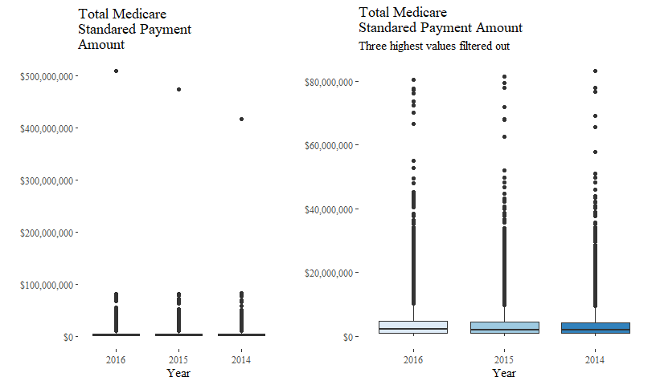<!-- -->

If we remove all outliers, though, Total Medicare Standard Payment Amout mostly resembles a normal distriution. 

```r
plt3 <- D %>%
    mutate(rank = rank(desc(`Total Medicare Standard Payment Amount`))) %>%
    arrange(rank) %>%
    filter(rank > 3) %>%
    ggplot(aes(x = Year, y=`Total Medicare Standard Payment Amount`, fill = Year)) + 
    geom_boxplot(outlier.shape = NA) +
    labs(title = "Total Medicare \nStandared Payment Amount", 
        subtitle = "Three highest values filtered out") + 
    ylab(" ")  +
    theme(legend.position="none", axis.title = element_text()) +
    scale_y_continuous(label = dollar, limits = c(0, 7600000)) +
    scale_fill_brewer()

plt4 <- D %>%
  mutate(logStandardPaymentAmount = log(`Total Medicare Standard Payment Amount`)) %>%
  ggplot(aes(x = Year, y=logStandardPaymentAmount, fill = Year)) + 
  geom_boxplot() + 
  labs(title = "Total Medicare \nStandared Payment Amount", 
       subtitle = "Values are log transformed") + ylab(" ") +
  theme(legend.position="none", axis.title = element_text()) +
  scale_fill_brewer()

plot_grid(plt3, plt4, align = "h", rel_widths = c(1, 1.3), axis = "t")
```

```
## Warning: Removed 1508 rows containing non-finite values (stat_boxplot).
```

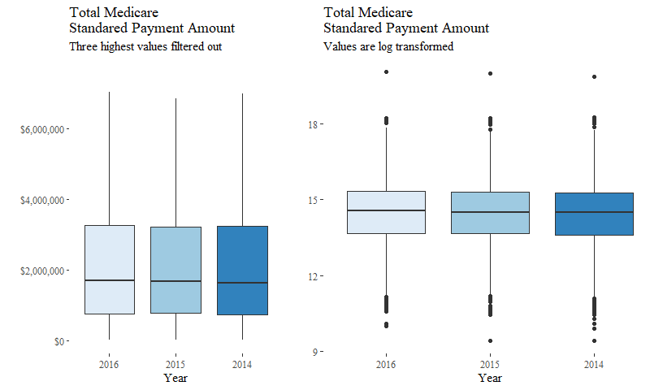<!-- -->

After removing these extreme estreme outliers, Standard Medicare Payment Amount is still skewed.With a normal distribution, log transformed values may be a more useful predictor. It is It is worth noting that the distributions appear to remain farily consistant over the three years in our dataset.

Let's see a correlation between our outcome variable and a variables that I would hypothesize would be positively correlated with Total Medicare Standard Payment. 

```r
D <- D %>%
  mutate(logStandardPaymentAmount = log(`Total Medicare Standard Payment Amount`))
CorVarLabs <- c("Standard Pmt", "Hospice beneficiaries", "Total Days", "Average Age", "# with Cancer")
D %>%
  select(`Total Medicare Standard Payment Amount`, 
         `Hospice beneficiaries`, 
         `Total Days`, 
         `Average Age`,
         `Hospice beneficiaries with a primary diagnosis of cancer`) %>% 
  ggpairs(title = "Correlation Matrix with Standard Payment", 
          columnLabels = CorVarLabs)
```

<!-- -->

How do these correlations with the Standard Payment Amount compare with correlations with Logged Standard Payment Amount?

```r
D %>%
  select(`logStandardPaymentAmount`, 
         `Hospice beneficiaries`, 
         `Total Days`, 
         `Average Age`,
         `Hospice beneficiaries with a primary diagnosis of cancer`) %>% 
  ggpairs(title = "Correlation Matrix with Logged Standard Payment", 
          columnLabels = CorVarLabs)
```

<!-- -->

Logging Standard Payment Amount decreases the correlation these selected predictor variables. It still may be useful in regressoin analyses

## Predictor Variables: Data Exploration and Liner Models by Variable Type

Between the orignal datasets and merged ones, there are a variety of varialbes to anlayze. This section analyzes each variable of interest, grouped both by variable type (categorical and numeric) and by category (service hours, number of benificiaries by diagnosis, number of benificiaries by race, and number of benificiaries by gender). 

I will analyze each variable individually and compare them to variables within their category using t-tests and/or linear regressions to test differenes within each category. 

### Categorical Predictor Variables

#### Data Exploration

**Region**

Summarize "Total Medicare Standard Payment Amount" and "Logged Total Medicare Standard Payment Amount" grouped by region and year

```r
D %>%
  group_by(Region) %>%
  summarise(Min = min(`Total Medicare Standard Payment Amount`),
            Q1 = quantile(`Total Medicare Standard Payment Amount`, .25),
            median = median(`Total Medicare Standard Payment Amount`), 
            Q3 = quantile(`Total Medicare Standard Payment Amount`, .75),
            max = max(`Total Medicare Standard Payment Amount`),
            mean = mean(`Total Medicare Standard Payment Amount`),
            sd = sd(`Total Medicare Standard Payment Amount`),
            n = n(),
            missing = count(is.na(`Total Medicare Standard Payment Amount`))) %>%
  arrange(desc(mean))
```

<div class="kable-table">

Region             Min          Q1    median        Q3         max      mean         sd      n   missing
----------  ----------  ----------  --------  --------  ----------  --------  ---------  -----  --------
Northeast     66370.61   1130719.3   2469996   5488644    55069310   4701323    6381407   1332         0
South         12533.50    997042.3   2214590   4494683   508882642   4531637   13678330   4750         0
Caribbean    139677.62   1643344.3   2743352   3791254    42399624   4468607    7002663    115         0
Midwest       21943.54    752023.8   1873480   4427457    72307285   3828595    5702301   2764         0
West          20066.94    609593.0   1506441   3709664    43524824   3127468    4562045   3088         0

</div>
The Northeast has the highest mean payment amounts and second highest median, behind the Caribbean. The South has the widest spread. This seems natural since it has the highest amount of providers as well. The West has the lowest amount mean. 

##### Linear Model Exploring Payment by Region

```r
lm(`Total Medicare Standard Payment Amount` ~ Region, data = D) %>%
  get_regression_table()
```

<div class="kable-table">

term                  estimate   std_error   statistic   p_value   lower_ci    upper_ci
----------------  ------------  ----------  ----------  --------  ---------  ----------
intercept           4468607.33    892146.3       5.009     0.000    2719857   6217357.6
RegionMidwest       -640012.78    910516.6      -0.703     0.482   -2424772   1144746.4
RegionNortheast      232715.77    929861.4       0.250     0.802   -1589962   2055393.8
RegionSouth           63029.46    902881.4       0.070     0.944   -1706763   1832822.2
RegionWest         -1341139.41    908606.6      -1.476     0.140   -3122155    439875.8

</div>

**Year**

```r
D %>%
  group_by(Year) %>%
  summarise(Min = min(`Total Medicare Standard Payment Amount`),
            Q1 = quantile(`Total Medicare Standard Payment Amount`, .25),
            median = median(`Total Medicare Standard Payment Amount`), 
            Q3 = quantile(`Total Medicare Standard Payment Amount`, .75),
            max = max(`Total Medicare Standard Payment Amount`),
            mean = mean(`Total Medicare Standard Payment Amount`),
            sd = sd(`Total Medicare Standard Payment Amount`),
            n = n(),
            missing = count(is.na(`Total Medicare Standard Payment Amount`))) %>%
  arrange(desc(mean))
```

<div class="kable-table">

Year         Min         Q1    median        Q3         max      mean         sd      n   missing
-----  ---------  ---------  --------  --------  ----------  --------  ---------  -----  --------
2016    21943.54   864861.5   2081425   4575784   508882642   4159611   10133316   4125         0
2015    12533.50   850154.8   1998732   4354607   473266501   4028250    9650059   4009         0
2014    12541.04   812344.8   1977470   4294485   416553977   3891069    8899534   3915         0

</div>
The mean and median payment accross the board has increased incrementally each year. 


Is this difference significant in a linear model?

```r
lm(`Total Medicare Standard Payment Amount` ~ Year, data = D) %>%
  get_regression_table()
```

<div class="kable-table">

term          estimate   std_error   statistic   p_value    lower_ci    upper_ci
----------  ----------  ----------  ----------  --------  ----------  ----------
intercept    4159610.9    149239.0      27.872     0.000   3867078.4   4452143.4
Year2015     -131361.0    212577.1      -0.618     0.537   -548046.3    285324.2
Year2014     -268541.9    213867.4      -1.256     0.209   -687756.4    150672.5

</div>
With insignificant p-vlaues for each of the years, there is not a significant difference by year. 


#### Let's break down Average Payment by Region and Year


```r
D %>%
  group_by(Region, Year) %>%
  summarise(Payment = mean(`Total Medicare Standard Payment Amount`)) %>%
  ggplot(aes(x = as.numeric(as.character(Year)), y = Payment, color= Region)) +
  geom_line(size = 0.9) + geom_point() + 
  labs(title = "Mean Total Medicare Standard Payment Amount by Region") + 
  xlab("Year") + ylab("Mean Payment") +
  scale_x_continuous(labels = 
      c("2014.0" = "2014", "2014.5" = " ", 
        "2015.0" = "2015", "2015.5" = " ", "2016.0" = "2016")) +
  scale_y_continuous(label = dollar) +
  scale_color_brewer()
```

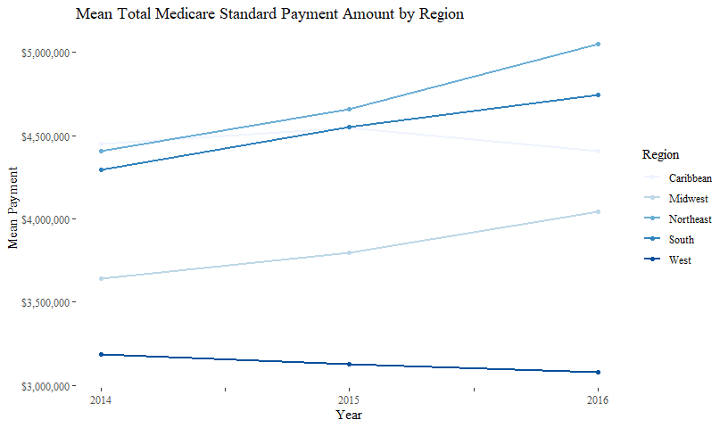<!-- -->
Payments are growing each year accross each region, except the West with a slight decline.


##### Intertion Rregression with Year and Region

Let's see if that gorwing progression holds up in an interaction linear model


```r
lm(`Total Medicare Standard Payment Amount` ~ Year*Region, data = D) %>%
  get_regression_table()
```

<div class="kable-table">

term                           estimate   std_error   statistic   p_value   lower_ci   upper_ci
-------------------------  ------------  ----------  ----------  --------  ---------  ---------
intercept                    4409769.18     1532382       2.878     0.004    1406053    7413485
Year2015                      135412.27     2167116       0.062     0.950   -4112484    4383308
Year2014                       40143.49     2196206       0.018     0.985   -4264774    4345061
RegionMidwest                -365963.59     1564422      -0.234     0.815   -3432482    2700555
RegionNortheast               637839.66     1599300       0.399     0.690   -2497046    3772725
RegionSouth                   333632.32     1551015       0.215     0.830   -2706607    3373872
RegionWest                  -1329208.91     1558556      -0.853     0.394   -4384229    1725812
Year2015:RegionMidwest       -380649.59     2212426      -0.172     0.863   -4717361    3956062
Year2014:RegionMidwest       -441547.91     2241049      -0.197     0.844   -4834365    3951269
Year2015:RegionNortheast     -524332.08     2261021      -0.232     0.817   -4956297    3907633
Year2014:RegionNortheast     -679993.19     2288218      -0.297     0.766   -5165270    3805284
Year2015:RegionSouth         -324338.27     2193558      -0.148     0.882   -4624065    3975388
Year2014:RegionSouth         -489483.91     2222384      -0.220     0.826   -4845715    3866748
Year2015:RegionWest           -90756.49     2206145      -0.041     0.967   -4415156    4233643
Year2014:RegionWest            65948.32     2236529       0.029     0.976   -4318009    4449906

</div>

Neither levels themselves nor their interactions have statistically significant p-values, so alone these are not great predictors. This is actually something of positive sign for the industry. It would be concerning if amount paid varied drastically by year or region given the nature of the service hospice centers provide, so these are slightly encouraging findings.

## Numeric Predictors of Interest

### Physician Services
- Physician Services: "Total number of hospice care physician services provided"

```r
fav_stats(D$`Physician Services`)
```

<div class="kable-table">

      min   Q1   median   Q3      max       mean         sd       n   missing
---  ----  ---  -------  ---  -------  ---------  ---------  ------  --------
        0    0        0   54   100641   306.6639   1952.223   10803      1246

</div>


There appears to be a very wide range with a large standard deviation. This variable is very skewed since both Q1 and the median are 0 hours, but the mean is about 307 hours. 


```r
D %>%
  ggplot(aes(y=`Physician Services`)) + geom_boxplot() +
  labs(title = "Physician Services",
       subtitle = "Total number of hospice care physician services provided") +
  ylab("Physician Service Hours")
```

```
## Warning: Removed 1246 rows containing non-finite values (stat_boxplot).
```

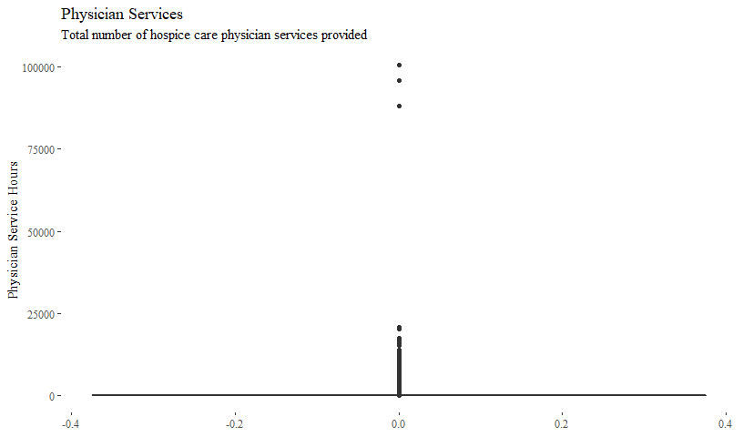<!-- -->
Indeed, there are several outliers present.

### Care Hours Spent
- Home Health Visit Hours per Day

```r
fav_stats(D$`Home Health Visit Hours per Day`)
```

<div class="kable-table">

      min     Q1   median     Q3    max        mean          sd       n   missing
---  ----  -----  -------  -----  -----  ----------  ----------  ------  --------
        0   0.19     0.27   0.37   3.48   0.3133646   0.2269501   12049         0

</div>
- Home Health Visit Hours per Day During Week Prior to Death

```r
fav_stats(D$`Home Health Visit Hours per Day During Week Prior to Death`)
```

<div class="kable-table">

      min     Q1   median     Q3   max        mean          sd       n   missing
---  ----  -----  -------  -----  ----  ----------  ----------  ------  --------
        0   0.19     0.28   0.42     8   0.3625512   0.3419532   12049         0

</div>

It is known that overall visit hours and, thus payments, are higher in th last week of life. Is that supported in this data? 

```r
t.test(D$`Home Health Visit Hours per Day`, 
       D$`Home Health Visit Hours per Day During Week Prior to Death`) %>% 
  list() %>% map_df(.,tidy)
```

<div class="kable-table">

   estimate   estimate1   estimate2   statistic   p.value   parameter     conf.low    conf.high  method                    alternative 
-----------  ----------  ----------  ----------  --------  ----------  -----------  -----------  ------------------------  ------------
 -0.0491867   0.3133646   0.3625512   -13.15535         0    20937.13   -0.0565152   -0.0418581  Welch Two Sample t-test   two.sided   

</div>
Yes, the expected amount of visit hours is significanlty higher in the last week prior to death than it is overal. There is an average increase in Home Health Visit Hours per day of 0.05 hours in the week prior to death. Given the circumstances, that is actually a bit less of an increase than I would have expected.
Lets see if there is a greter increase in other types of care hours in the week prior to death. 


```r
D %>%
  select(`Provider ID`,
         `Home Health Visit Hours per Day`, 
         `Home Health Visit Hours per Day During Week Prior to Death`) %>%
  gather(key = "Type", value = "Values", 2:3) %>%
  ggplot(aes(x=Values, fill = Type)) + 
  geom_density() +
  ggtitle("Home Health Visit Hours per Day") +
  theme(legend.position="bottom")
```

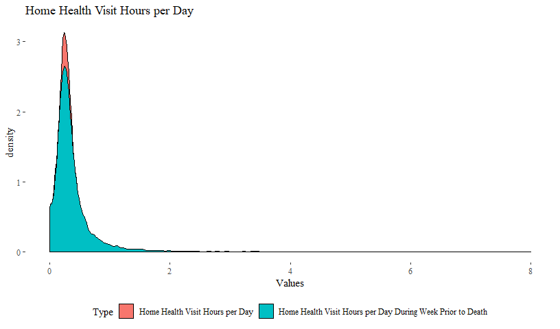<!-- -->
The density plot of their logged values show that there is only a slight increase in hours per week in the week prior to death. This is likely due to a few outliers as well. 

- Skilled Nursing Visit Hours per Day

```r
fav_stats(D$`Skilled Nursing Visit Hours per Day`)
```

<div class="kable-table">

      min     Q1   median     Q3    max        mean          sd       n   missing
---  ----  -----  -------  -----  -----  ----------  ----------  ------  --------
        0   0.21     0.26   0.33   5.39   0.2856171   0.1708162   12049         0

</div>

- Skilled Nursing Visit Hours per Day During Week Prior to Death

```r
fav_stats(D$`Skilled Nursing Visit Hours per Day During Week Prior to Death`)
```

<div class="kable-table">

      min    Q1   median     Q3     max       mean         sd       n   missing
---  ----  ----  -------  -----  ------  ---------  ---------  ------  --------
        0   0.6      0.8   1.06   19.37   1.035322   1.042784   12049         0

</div>

Does the hypothesized difference stand for Skilled Nursing Visits? 

```r
t.test(D$`Skilled Nursing Visit Hours per Day`, 
       D$`Skilled Nursing Visit Hours per Day During Week Prior to Death`) %>% 
  list() %>% map_df(.,tidy) 
```

<div class="kable-table">

   estimate   estimate1   estimate2   statistic   p.value   parameter     conf.low   conf.high  method                    alternative 
-----------  ----------  ----------  ----------  --------  ----------  -----------  ----------  ------------------------  ------------
 -0.7497054   0.2856171    1.035322   -77.87929         0     12694.1   -0.7685748   -0.730836  Welch Two Sample t-test   two.sided   

</div>
Yes, there is a statistically significant increase in average hours per day by skilled nurses in the week prior to death than there are overall by 0.75 hours. This continues our expected trend of a slight increase in care hours in the week prior to death. 

- Social Service Visit Hours per Day

```r
fav_stats(D$`Social Service Visit Hours per Day`)
```

<div class="kable-table">

      min     Q1   median     Q3    max        mean          sd       n   missing
---  ----  -----  -------  -----  -----  ----------  ----------  ------  --------
        0   0.03     0.04   0.06   0.47   0.0432675   0.0255404   12049         0

</div>

- Social Service Visit Hours per Day During Week Prior to Death

```r
fav_stats(D$`Social Service Visit Hours per Day During Week Prior to Death`)
```

<div class="kable-table">

      min     Q1   median     Q3    max        mean          sd       n   missing
---  ----  -----  -------  -----  -----  ----------  ----------  ------  --------
        0   0.05     0.08   0.12   1.07   0.0933679   0.0665678   12049         0

</div>

Does the difference hold for Social Service Hours per Day?

```r
t.test(D$`Social Service Visit Hours per Day`, 
       D$`Social Service Visit Hours per Day During Week Prior to Death`) %>% 
  list() %>% map_df(.,tidy)
```

<div class="kable-table">

   estimate   estimate1   estimate2   statistic   p.value   parameter     conf.low    conf.high  method                    alternative 
-----------  ----------  ----------  ----------  --------  ----------  -----------  -----------  ------------------------  ------------
 -0.0501004   0.0432675   0.0933679   -77.13154         0    15519.86   -0.0513736   -0.0488272  Welch Two Sample t-test   two.sided   

</div>
Yes. Continuing this trend, there is an average incraese in hours visited by social service representatives in the week  prior to death. 

#### Linear Regression by type of hours spent with patients

```r
mVisits <- lm(`Total Medicare Standard Payment Amount` ~ 
   `Home Health Visit Hours per Day` +
   `Home Health Visit Hours per Day During Week Prior to Death` +
   `Skilled Nursing Visit Hours per Day` +
   `Skilled Nursing Visit Hours per Day During Week Prior to Death` +
   `Social Service Visit Hours per Day` +
   `Social Service Visit Hours per Day During Week Prior to Death`, 
   data = D)
get_regression_table(mVisits)
```

<div class="kable-table">

term                                                                  estimate   std_error   statistic   p_value      lower_ci     upper_ci
-----------------------------------------------------------------  -----------  ----------  ----------  --------  ------------  -----------
intercept                                                             547225.3    215837.7       2.535     0.011      124148.7     970301.9
`Home Health Visit Hours per Day`                                   -2526305.4    526784.5      -4.796     0.000    -3558887.8   -1493723.1
`Home Health Visit Hours per Day During Week Prior to Death`         5282354.9    354670.5      14.894     0.000     4587143.6    5977566.3
`Skilled Nursing Visit Hours per Day`                                 832342.8    639300.5       1.302     0.193     -420789.1    2085474.7
`Skilled Nursing Visit Hours per Day During Week Prior to Death`     1349556.5     99011.4      13.630     0.000     1155478.2    1543634.8
`Social Service Visit Hours per Day`                                -9206518.6   5057542.3      -1.820     0.069   -19120115.8     707078.6
`Social Service Visit Hours per Day During Week Prior to Death`     12009895.1   1890417.2       6.353     0.000     8304373.0   15715417.1

</div>

This linear model is quite interesting and suprising to me. Each of the types of hours are statistically significant except Skilled Nursing Visit Hours per day, and Social Service Visit Hous per Day. Suprisingly, the amount of Home Health Visit Hours per Day and Social Service Visit Hours per Day had significant negaitve coefficients. For Home Health Visit Hours per Day, for each increase hour visited, we expect a *decrease* in standard payment amount by *2526305.4*. However, this linear model alone has a low explanatory capacity, explaining only 6.62% of the overall variation in Total Medicare Standard Payment Amount. To assess if this is the result of very skewed data among all predictor and outcome variales, I will rerun the model using logged predictor and outcome values. 

- **Regression with logged values**

```r
# create new dataframe for regression analysis of logged values
DbyVistLog <- D %>%
#### select only needed variables
  select(`Provider ID`,
        `Total Medicare Standard Payment Amount`,
        `Home Health Visit Hours per Day`,
        `Home Health Visit Hours per Day During Week Prior to Death`,
        `Skilled Nursing Visit Hours per Day`, 
        `Skilled Nursing Visit Hours per Day During Week Prior to Death`, 
        `Social Service Visit Hours per Day`, 
        `Social Service Visit Hours per Day During Week Prior to Death`) %>%
### filter out NAs
  filter(!is.na(`Total Medicare Standard Payment Amount`) & 
         !is.na(`Home Health Visit Hours per Day`) & 
         !is.na(`Home Health Visit Hours per Day During Week Prior to Death`) &
         !is.na(`Skilled Nursing Visit Hours per Day`) &
         !is.na(`Skilled Nursing Visit Hours per Day During Week Prior to Death`) & 
         !is.na(`Social Service Visit Hours per Day`) &
         !is.na(`Social Service Visit Hours per Day During Week Prior to Death`)) %>%
### mutate with logging each value plus 1 (since min of multiple variables is 0)
  mutate(lpmt = (log((`Total Medicare Standard Payment Amount`)+1)),
         lHHVisitHRs = (log((`Home Health Visit Hours per Day`)+1)),
         lHHVisitHRsD = (log((`Home Health Visit Hours per Day During Week Prior to Death`)+1)),
         lSNV = (log((`Skilled Nursing Visit Hours per Day`)+1)),
         lSNVD = (log((`Skilled Nursing Visit Hours per Day During Week Prior to Death`)+1)),
         lSSVH = (log((`Social Service Visit Hours per Day`)+1)),
         lSSVHD = (log((`Social Service Visit Hours per Day During Week Prior to Death`)+1)))
# create and output model
mVisitsL <- lm(lpmt ~ lHHVisitHRs + lHHVisitHRsD + lHHVisitHRsD + lSNV + lSNVD  + lSSVH + lSSVHD, data = DbyVistLog)
get_regression_table(mVisitsL)
```

<div class="kable-table">

term            estimate   std_error   statistic   p_value   lower_ci   upper_ci
-------------  ---------  ----------  ----------  --------  ---------  ---------
intercept         13.789       0.034     410.747     0.000     13.723     13.855
lHHVisitHRs        0.222       0.120       1.851     0.064     -0.013      0.457
lHHVisitHRsD       1.279       0.095      13.447     0.000      1.093      1.465
lSNV              -0.705       0.149      -4.716     0.000     -0.997     -0.412
lSNVD              0.413       0.047       8.867     0.000      0.321      0.504
lSSVH             -6.403       0.723      -8.859     0.000     -7.820     -4.986
lSSVHD             4.767       0.291      16.394     0.000      4.197      5.337

</div>
Even after logging the values, a Social Service Visit Hours per Day still displays negative correlation with Total Medicare Standard Payment Amount. Interpreting the logged regression, each percent increase in Social Service Visit hours predicts a 6.403% *decrease* in Total Medicare Standard Payment Amount. After logging variables, this model also shows a predicted slight percent *decrease* in Total Medicare Standard Payment Amount with each percent increase in Skilled Nursing Visit Hours.

Model Diagnostics:

```r
get_regression_summaries(mVisitsL)
```

<div class="kable-table">

 r_squared   adj_r_squared        mse       rmse   sigma   statistic   p_value   df
----------  --------------  ---------  ---------  ------  ----------  --------  ---
     0.097           0.097   1.414159   1.189184    1.19     216.597         0    7

</div>

```r
get_regression_points(mVisitsL) %>%
   ggplot(aes(x=residual)) + geom_density() +
   ggtitle("Residuals from mVisits Regression Model") 
```

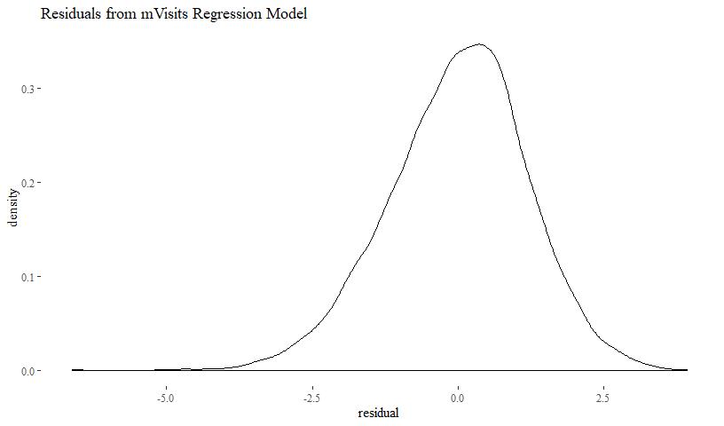<!-- -->
Even the logged model still has a low overall predicitve capacity with an R Squared of only 9.70%. The model as a whole is statistically significant and the residuals do appear to be normal. 

###  Diagnosis Types 

```r
# Create tidy dataframe with number of beneficiaries by type for easier analysis
DbyDiagnosis <- D %>%
  select(`Provider ID`,
         `Hospice beneficiaries with a primary diagnosis of cancer`, 
         `Hospice beneficiaries with a primary diagnosis of dementia`,
         `Hospice beneficiaries with a primary diagnosis of stroke`,
         `Hospice beneficiaries with a primary diagnosis of circulatory/heart disease`,
         `Hospice beneficiaries with a primary diagnosis of respiratory disease`) %>%
  gather(key = "Type", value = "Beneficiaries", 2:6)
```

Summary Statistics by Diagnosis Type

```r
DbyDiagnosis %>%  
  group_by(Type) %>%
  filter(!is.na(Beneficiaries)) %>%
  summarise(Min = min(Beneficiaries),
            Q1 = quantile(Beneficiaries, .25),
            median = median(Beneficiaries), 
            Q3 = quantile(Beneficiaries, .75),
            max = max(Beneficiaries),
            mean = mean(Beneficiaries),
            sd = sd(Beneficiaries),
            n = n()) %>%
  arrange(desc(mean))
```

<div class="kable-table">

Type                                                                           Min   Q1   median    Q3    max        mean          sd       n
----------------------------------------------------------------------------  ----  ---  -------  ----  -----  ----------  ----------  ------
Hospice beneficiaries with a primary diagnosis of cancer                         0   27       54   125   5426   117.23597   205.04688   10048
Hospice beneficiaries with a primary diagnosis of dementia                       0   24       46    94   2078    83.31137   120.07482    9362
Hospice beneficiaries with a primary diagnosis of circulatory/heart disease      0   24       44    88   4993    78.73133   130.76801    9867
Hospice beneficiaries with a primary diagnosis of respiratory disease            0   19       33    65   2398    57.41664    83.78012    7546
Hospice beneficiaries with a primary diagnosis of stroke                         0   15       27    54   8336    52.11899   158.85912    6757

</div>


```r
DbyDiagnosis %>%
  ggplot(aes(x = Type, y = Beneficiaries, color = Type)) + 
  geom_boxplot() + 
  theme(legend.position="none") +
  scale_x_discrete(labels = c("Cancer", "Dementia", "Stroke", "Circulatory/Heart", "Respiratory")) + 
  labs(title = "Number of Benificiaries by Primary Diagnosis") +
  ylab("Number of Distinct Beneficiaries") +
  scale_color_brewer()
```

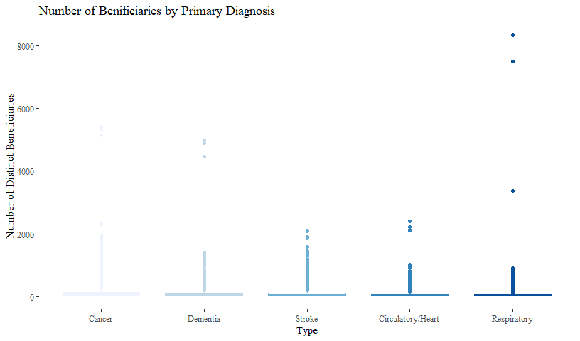<!-- -->
There are some extreme outliers, especially in Cancer, Dementia, and Respiratory 


```r
DbyDiagnosis %>%
  ggplot(aes(x = Type, y = log(Beneficiaries), fill = Type)) + 
  geom_boxplot(outlier.shape = NA) + 
  scale_x_discrete(labels = c("Cancer", "Dementia", "Stroke", "Circulatory/Heart", "Respiratory")) + 
  labs(title = "Number of Benificiaries by Primary Diagnosis",
       subtitle = "Values are Logged") +
  ylab("Number of Distinct Beneficiaries") + 
  theme(legend.position = "none") +
  scale_color_brewer()
```

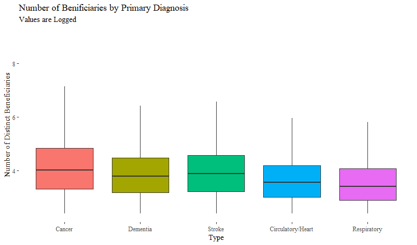<!-- -->
After logging, the distribution acorss primary diagnosis type is both consistant and normal between diagnosies. 


### Regression by Diagnosis

```r
DiagMod <- lm(log((`Total Medicare Standard Payment Amount`)+1) ~ 
   log((`Hospice beneficiaries with a primary diagnosis of cancer`)+1) + 
   log((`Hospice beneficiaries with a primary diagnosis of dementia`)+1) +
   log((`Hospice beneficiaries with a primary diagnosis of stroke`)+1) +
   log((`Hospice beneficiaries with a primary diagnosis of circulatory/heart disease`)+1) +
   log((`Hospice beneficiaries with a primary diagnosis of respiratory disease`)+1), 
   data = D)
get_regression_table(DiagMod) 
```

<div class="kable-table">

term                                                                                        estimate   std_error   statistic   p_value   lower_ci   upper_ci
-----------------------------------------------------------------------------------------  ---------  ----------  ----------  --------  ---------  ---------
intercept                                                                                     11.231       0.019     591.584         0     11.194     11.268
log((`Hospice beneficiaries with a primary diagnosis of cancer`) + 1)                         -0.072       0.007     -10.481         0     -0.086     -0.059
log((`Hospice beneficiaries with a primary diagnosis of dementia`) + 1)                        0.362       0.006      63.777         0      0.351      0.373
log((`Hospice beneficiaries with a primary diagnosis of stroke`) + 1)                          0.195       0.007      29.524         0      0.182      0.208
log((`Hospice beneficiaries with a primary diagnosis of circulatory/heart disease`) + 1)       0.362       0.009      38.904         0      0.344      0.381
log((`Hospice beneficiaries with a primary diagnosis of respiratory disease`) + 1)             0.162       0.009      18.099         0      0.145      0.180

</div>
This logged model shows several diagnosies with minimal predictive power. Each coefficient is statistically significant at a 0.01 alpha level. Beneficiaries with primary diagnoses of cancer or circulatory/heart had the highest impact on Total Medicare Standard Payment Amount; with each percent increase in the number of benificiaries with either cancer or circulatory/heart disease, we would expect a 0.362 percent increase in Total Medicare Standard Payment Amount. While this may seem small, this impact adds up over time!

### Gender Distribution

```r
DbyGender <- D %>%
  select(`Provider ID`, `Female hospice beneficiaries`, `Male hospice beneficiaries`) %>%
  gather(key = "Gender", value = "Amount", 2:3) %>%
  filter(!is.na(Amount)) 
```


```r
DbyGender %>%  
  group_by(Gender) %>%
  summarise(Min = min(Amount),
            Q1 = quantile(Amount, .25),
            median = median(Amount), 
            Q3 = quantile(Amount, .75),
            max = max(Amount),
            mean = mean(Amount),
            sd = sd(Amount),
            n = n(),
            missing = count(is.na(Amount))) %>%
  arrange(desc(mean))
```

<div class="kable-table">

Gender                          Min   Q1   median    Q3     max       mean         sd       n   missing
-----------------------------  ----  ---  -------  ----  ------  ---------  ---------  ------  --------
Female hospice beneficiaries     11   54      114   246   15554   224.6755   407.2776   11116         0
Male hospice beneficiaries       11   37       79   172   10325   157.8419   287.6987   11116         0

</div>


```r
DbyGender %>%
  ggplot(aes(x=Gender, y = Amount, color = Gender)) +
  geom_boxplot() + 
  labs(title = "Number of Hospice Benificiaries by Gender") +
  theme(legend.position="none") +
  scale_color_brewer()
```

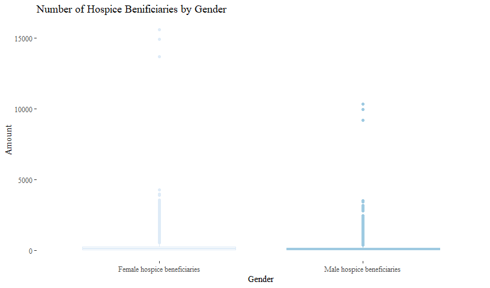<!-- -->


```r
# count outliers by gender
library(grDevices)
F <- DbyGender %>% 
  filter(Gender == "Female hospice beneficiaries")
FL <- length(F$Amount[which(F$Amount %in% boxplot.stats(F$Amount)$out)])
M <- DbyGender %>% 
  filter(Gender == "Male hospice beneficiaries")
ML <- length(M$Amount[which(M$Amount %in% boxplot.stats(M$Amount)$out)])
```

The distribution appears to be skewed, but we have 1004 outliers for the amount of female benificiaries and 1040 outliers for the amount of male benificiaries. 


```r
DbyGender %>%
  ggplot(aes(x=Gender, y = Amount, fill = Gender)) +
  geom_boxplot(outlier.shape = NA) + 
  ylim(c(0,400)) +
  labs(title = "Number of Hospice Benificiaries by Gender", 
       subtitle = "Outliers Removed") +
  theme(legend.position="none") +
  scale_fill_brewer()
```

```
## Warning: Removed 2471 rows containing non-finite values (stat_boxplot).
```

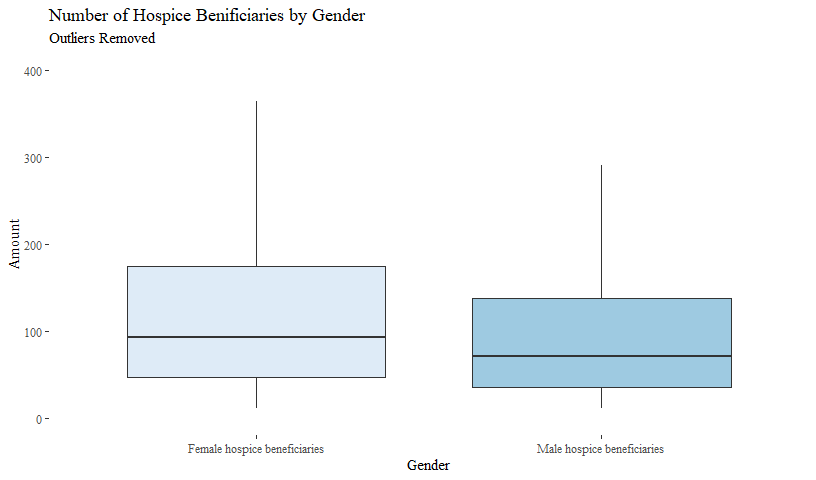<!-- -->
Distribution is still somewhat skewed, but resembles closer to a normal distribution. 

#### Regression model by Gender
Is there a difference in impact on Total Standard Payment by number of benificiaries by gender. 

```r
GMod <- lm(log(`Total Medicare Standard Payment Amount`) ~ 
   log(`Female hospice beneficiaries`) +
   log(`Male hospice beneficiaries`), 
   data = D)
get_regression_table(GMod) 
```

<div class="kable-table">

term                                   estimate   std_error   statistic   p_value   lower_ci   upper_ci
------------------------------------  ---------  ----------  ----------  --------  ---------  ---------
intercept                                10.046       0.015     652.148     0.000     10.016     10.076
log(`Female hospice beneficiaries`)       0.922       0.013      72.061     0.000      0.897      0.947
log(`Male hospice beneficiaries`)         0.042       0.013       3.278     0.001      0.017      0.067

</div>
In using log values, we see a 0.88% stronger impact of female beneficiaries on Total Medicare Standard Payment Amount than we do for male beneficiaries. Both factors are statistically significant, though. This model alone, though, has a very strong exlanatory capacity with an R squared at 89.7%. That is by far the strongest model within each category. 

All told, this indicates that there are noteably more women than men in the US hospice system. 

### Racial Distributions

```r
DbyRace <- D %>%
  select(`Provider ID`, 
         `White hospice beneficiaries`, 
         `Black hospice beneficiaries`, 
         `Asian hospice beneficiaries`, 
         `Hispanic hospice beneficiaries`, 
         `Other/unknown race hospice beneficiaries`) %>%
  gather(key = "Race", value = "Amount", 2:6) %>%
  filter(!is.na(Amount))
```


```r
DbyRace %>%
  group_by(Race) %>%
  summarise(Min = min(Amount),
            Q1 = quantile(Amount, .25),
            median = median(Amount), 
            Q3 = quantile(Amount, .75),
            max = max(Amount),
            mean = mean(Amount),
            sd = sd(Amount),
            n = n(),
            missing = count(is.na(Amount))) %>%
  arrange(desc(mean))
```

<div class="kable-table">

Race                                        Min   Q1   median    Q3     max         mean          sd       n   missing
-----------------------------------------  ----  ---  -------  ----  ------  -----------  ----------  ------  --------
White hospice beneficiaries                   0   63      147   335   16332   306.110458   539.10949   11570         0
Black hospice beneficiaries                   0    0       19    48    2917    45.129267    98.52297    7295         0
Hispanic hospice beneficiaries                0    0       13    37    6145    43.443305   171.20910    5556         0
Asian hospice beneficiaries                   0    0        0     0    1230     7.722306    40.40040    5967         0
Other/unknown race hospice beneficiaries      0    0        0    11     234     6.733256    15.77411    3449         0

</div>


```r
DbyRace$RaceLabel <- word(DbyRace$Race, 1) 
#extract the first word in the varaible, caputring the only word needed for the boxplot label

DbyRace %>%  
  ggplot(aes(x=RaceLabel, y = Amount, color = Race)) +
  geom_boxplot() + 
  labs(title = "Number of Hospice Benificiaries by Race") +
  theme(legend.position="none") + 
  xlab("Race") + ylab("Amount of Beifiareis") +
  scale_color_brewer()
```

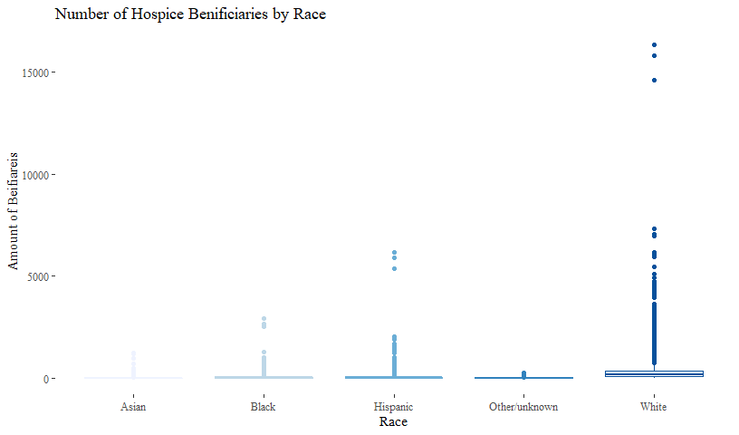<!-- -->


```r
DbyRace %>%  
  ggplot(aes(x=RaceLabel, y = Amount, fill = Race)) +
  geom_boxplot(outlier.shape = NA) + 
  labs(title = "Number of Hospice Benificiaries by Race",
       subtitle = "Outliers Removed") +
  theme(legend.position="none") + 
  ylim(c(0, 550)) +
  xlab("Race") + ylab("Amount of Beifiareis") +
  scale_fill_brewer()
```

```
## Warning: Removed 1766 rows containing non-finite values (stat_boxplot).
```

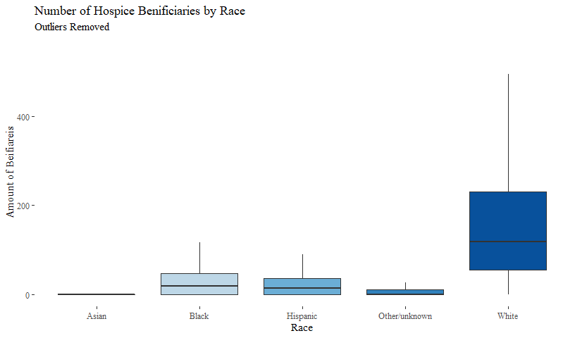<!-- -->

It is difficult to see the distribution of amount of benificiaries by race, particularly considering the range for amount of White identifying benificiaries is so much higher than it is for the each of the other Race categories. 


```r
DbyRace %>%
  group_by(Race) %>%  
  summarise(total = sum(Amount)) %>%
  mutate(percent = percent(total/sum(total)))
```

<div class="kable-table">

Race                                          total  percent 
-----------------------------------------  --------  --------
Asian hospice beneficiaries                   46079  1.1%    
Black hospice beneficiaries                  329218  7.9%    
Hispanic hospice beneficiaries               241371  5.8%    
Other/unknown race hospice beneficiaries      23223  0.6%    
White hospice beneficiaries                 3541698  84.7%   

</div>

For a clearer visualization of this descrepency, let's see the difference just between White and White.


```r
DbyRace <- DbyRace %>%
  mutate(White = RaceLabel == "White")
DbyRace %>%
  group_by(White) %>%  
  summarise(total = sum(Amount)) %>%
  mutate(percent = percent(total/sum(total)))
```

<div class="kable-table">

White      total  percent 
------  --------  --------
FALSE     639891  15.3%   
TRUE     3541698  84.7%   

</div>


```r
DbyRace %>%  
  ggplot(aes(x=White, y = Amount, fill = White)) +
  geom_boxplot(outlier.shape = NA) + 
  labs(title = "Number of Hospice Benificiaries by Race",
       subtitle = "Outliers Removed, Non-White and White") +
  theme(legend.position="none") + 
  ylim(c(0, 550)) +
  xlab("White") + ylab("Amount of Beifiareis") +
  scale_fill_brewer()
```

```
## Warning: Removed 1766 rows containing non-finite values (stat_boxplot).
```

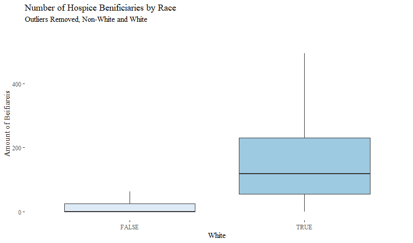<!-- -->

It is interesting to note that 84.7% of the beneficiaries in the dataset are identified as white. This could be an anomolie or the result of several intersecting socioeconoimc and historical factors pertaining to access to healh care, especially end-of-life care. This is consistant [Cohen's 2008 systematic review](https://www.ncbi.nlm.nih.gov/pubmed/18588409) of racial disparities in hospice care system.

Let's see how this logic holds up in a regression model on Total Medicare Standard Payment Amount. 

```r
RMod <- lm(`Total Medicare Standard Payment Amount` ~ 
   `White hospice beneficiaries` +
   `Black hospice beneficiaries` + 
   `Asian hospice beneficiaries` +
   `Hispanic hospice beneficiaries` + 
   `Other/unknown race hospice beneficiaries`, data = D)
get_regression_table(RMod)
```

<div class="kable-table">

term                                             estimate    std_error   statistic   p_value       lower_ci     upper_ci
-------------------------------------------  ------------  -----------  ----------  --------  -------------  -----------
intercept                                     -999832.977   136345.786      -7.333     0.000   -1267300.053   -732365.90
`White hospice beneficiaries`                   10677.084      202.108      52.829     0.000      10280.612     11073.56
`Black hospice beneficiaries`                   11347.950     1113.098      10.195     0.000       9164.406     13531.50
`Asian hospice beneficiaries`                    5467.372     3376.764       1.619     0.106      -1156.766     12091.51
`Hispanic hospice beneficiaries`                44770.962      618.849      72.345     0.000      43556.976     45984.95
`Other/unknown race hospice beneficiaries`     -76587.338    17497.609      -4.377     0.000    -110912.082    -42262.59

</div>

```r
summary(RMod)$r.squared
```

```
## [1] 0.9701032
```

This model has a vey high predictive power with an R squared of 97.0% with each coefficient being statistically significant. According to this model, each added white beneficiary contributes an expected \$10677.08 in standard medicare payments with a relatively low standard error of \$202.11. Each added added Black beneficiary contributes an expected \$11347.95 in standard medicare payments, but with a relatively high standard error of \$1113.10. This variation is again likely due to the notably more white beneficiares in the dataset. 

## Final Conclusions and Takeaways
- Diagnosis Type, Gender, and Race all proved to be strong predictors of standard medicare payments
- Year and Region did not prove to be strong predictors. 
- There are noteably more women then men recieving treatment in the hospice system.
- Hospice payments are tend to be skewed with a small group of highlgy differentiated outliers. If one is interested in detecting fraud, identifying unique characteristics of those outliers is a useful starting point. 

### Next steps for further exploration
There is so much more to explore about the hospice system using this data set as a startin point. Some initial ideas to include: 

- Analyze average age as a variable
- Create regression analyses of within each variable grouping to find the stongest predictors.  
